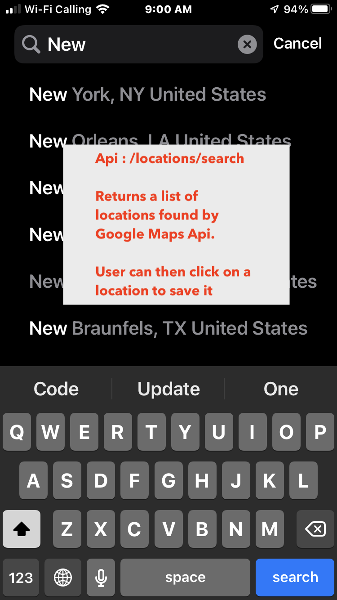
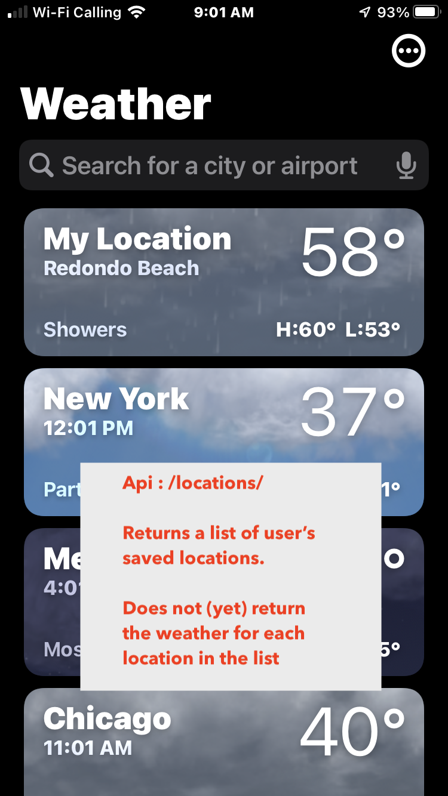
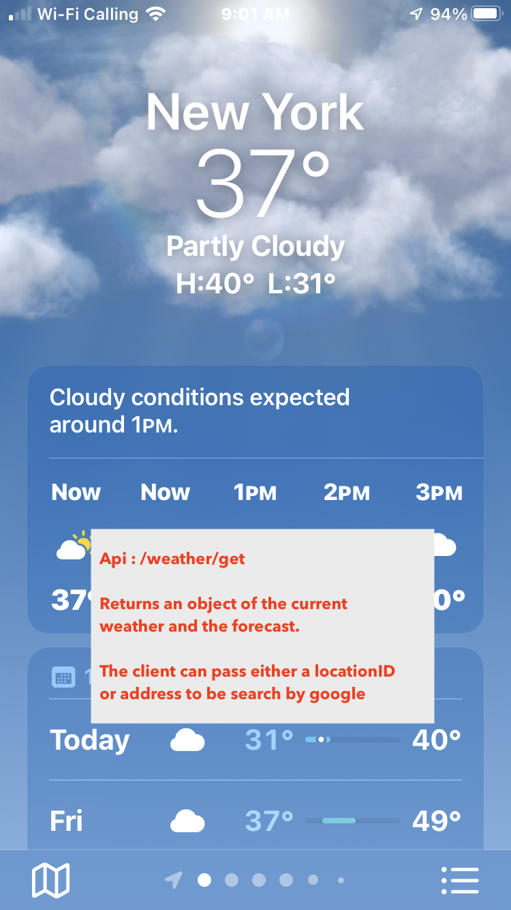

# Weather Api Project

Notes on my weather api project

## Task

Weather Application

➠ The Ask
Create an API that pulls weather data from a free external service (Yahoo Weather, tomorrow.io,
etc.) This API will need to store usernames, search for locations, associate locations with a user,
etc. — functionality that you would typically need if the API were to be consumed by a mobile app
or web application.
The application does not need to be hosted — no need to set up servers, databases, front-end
site, etc. We want to see the actual source code and your decision-making when building an
application from scratch.
Please do not spend any more than 5-8 hours on this.
➠ Specifics
Integrate whichever weather source you feel comfortable integrating and explain why you selected
that source. This source should be consumed and utilized for providing weather information for the
API and front-end applications. You will decide what information is relevant to a user from what is
available from your source.
Integrate a way to search for locations. You will decide how the API should search and what
information might need to be stored.
Create an API that will allow:
User Creation: simple storage of a username is sufficient
User Login: simple input of a username is sufficient
Location Search: location storage and data "GET" for the information you feel is relevant for
the API.

This task should be solved using Java.

➠ Submission Instructions
Commit the code to GitHub, BitBucket, or other hosted public Git repository and share it with our
team to review. 

## Notes:

- I spent 4-5 hours and unfortunately I can't spend more time but most of the functionality should be working
- I used Spring Boot to bootstrap the application
- I chose Open Weather Api because it seemed to have the current weather and forecast in a simple api
- I also tried Yahoo, but they kept returning a 404. Maybe Because I was not approved yet.
- I decided to use Google Maps Geocoding Api to get coordinates to then be used by the weather api
- I allow the client to pass either a locationID (which they can get from the list api) or an address to be geocoded by google

## Functionality 
- User can register or login with username (with some basic duplicate checking)
- User can search, add or remove saved locations
- User can view weather and forecast for locations
- User can pass in a raw address query and we will hit google to geocode it
- 

## Wireframe

